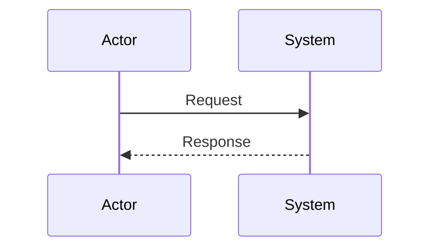
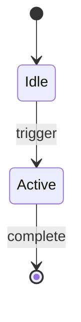
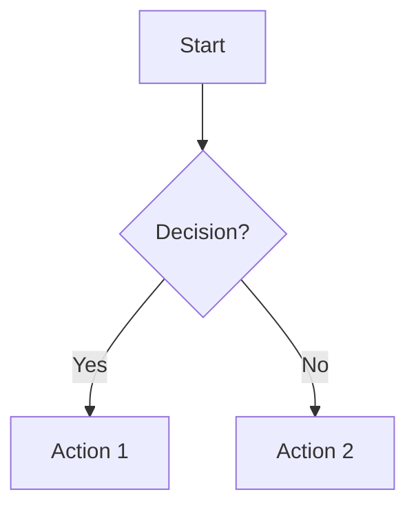
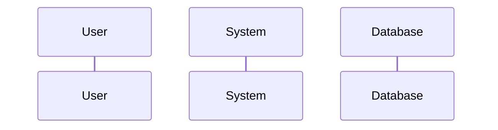
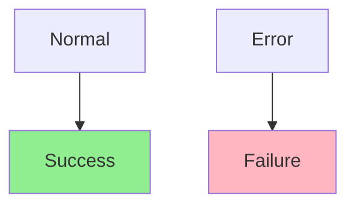
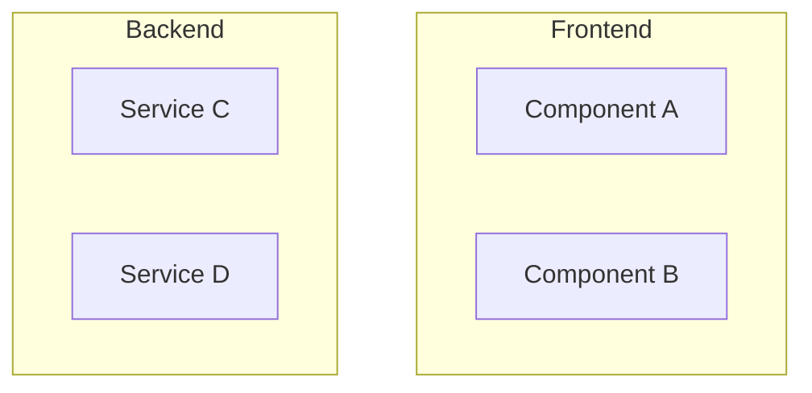

# Diagram Creation Best Practices for AI Agents

This document outlines the best approaches for AI agents to create effective technical diagrams for documentation.

## Why Diagrams Matter

Visual diagrams significantly improve technical documentation by:
- **Reducing cognitive load**: Complex processes become easier to understand
- **Supporting different learning styles**: Visual learners benefit greatly
- **Enabling quick reference**: Diagrams provide instant overview of systems
- **Facilitating troubleshooting**: Flow charts guide users through debug processes

## Best Diagram Tools for AI Agents

### 1. Mermaid (Recommended)
**Best choice for AI agents** because:
- Text-based syntax (AI-friendly)
- Renders directly in Markdown
- Version control friendly
- No external dependencies
- Wide platform support (GitHub, GitLab, etc.)

**Supported diagram types:**
- Flowcharts (`flowchart TD`)
- Sequence diagrams (`sequenceDiagram`)
- State diagrams (`stateDiagram-v2`)
- Class diagrams (`classDiagram`)
- Git graphs (`gitGraph`)
- Gantt charts (`gantt`)

### 2. PlantUML
- More feature-rich than Mermaid
- Requires external rendering service
- Good for complex enterprise diagrams
- Less universally supported

### 3. ASCII Art
- Universal compatibility
- Version control friendly
- Limited visual appeal
- Good for simple structures

## Diagram Type Selection Guide

### Sequence Diagrams
**Use for:** Process flows with multiple actors/components
**Example:** System startup, API communication, user interactions

### State Diagrams
**Use for:** System states and transitions
**Example:** Safety modes, connection states, operational phases

### Flowcharts
**Use for:** Decision trees, troubleshooting, algorithms
**Example:** Debug procedures, configuration flows

### Class Diagrams
**Use for:** Code architecture, object relationships
**Example:** Software design, API structures

## Best Practices for AI Diagram Creation

### 1. Start Simple
- Begin with basic structure
- Add complexity incrementally
- Test rendering at each step

### 2. Use Consistent Naming
- Clear, descriptive labels
- Consistent abbreviations
- Avoid technical jargon in user-facing docs

### 3. Optimize for Readability
- Logical flow direction (top-to-bottom, left-to-right)
- Appropriate spacing
- Group related elements
- Use colors strategically (but ensure accessibility)

### 4. Include Context
- Add descriptive notes
- Provide legends when needed
- Reference related documentation
- Include code file references

### 5. Validate Diagrams
- Ensure syntax is correct
- Test rendering in target platform
- Verify accuracy against implementation
- Get feedback from technical reviewers

## Mermaid Syntax Tips for AI Agents

### Common Patterns

**Participants in sequence diagrams:**

**Styling in flowcharts:**

**Sub-graphs for organization:**

### Syntax Validation
Always validate syntax by:
1. Using online Mermaid editors
2. Testing in target rendering environment
3. Checking for common syntax errors:
   - Missing quotes around spaces
   - Incorrect arrow syntax
   - Unclosed subgraphs

## Integration Strategies

### In Documentation Files
- Place diagrams at logical points in text
- Provide both diagram and text explanation
- Reference specific diagram elements in text

### Cross-References
- Link diagrams to code files with line numbers
- Reference related diagrams in other documents
- Maintain consistency across diagram sets

### Maintenance
- Update diagrams when code changes
- Version control diagram source files
- Regular review for accuracy
- Document diagram update procedures

## Common Anti-Patterns to Avoid

### 1. Over-Complexity
- Too many elements in single diagram
- Overly detailed for target audience
- Multiple concepts in one diagram

### 2. Poor Layout
- Crossing lines unnecessarily
- Inconsistent spacing
- Unclear flow direction

### 3. Inconsistent Styling
- Mixed diagram types inappropriately
- Inconsistent naming conventions
- Conflicting color schemes

### 4. Missing Context
- Diagrams without explanatory text
- No reference to implementation
- Unclear scope or boundaries

## AI-Specific Considerations

### Iterative Improvement
AI agents should:
1. Create initial diagram based on requirements
2. Review for clarity and accuracy
3. Refine based on feedback or validation
4. Test rendering in target environment

### Documentation Integration
- Ensure diagrams support the written content
- Provide alternative text descriptions
- Consider accessibility requirements
- Maintain consistency with existing documentation style

### Collaboration with Humans
- Solicit feedback on diagram effectiveness
- Verify technical accuracy with domain experts
- Adjust complexity based on audience feedback
- Document decision rationale for future reference

## Tools and Resources

### Online Editors
- [Mermaid Live Editor](https://mermaid.live/)
- [PlantUML Online](http://www.plantuml.com/plantuml/)

### IDE Extensions
- Mermaid Preview (VS Code)
- PlantUML (various IDEs)

### Validation Tools
- Mermaid CLI for batch validation
- GitHub Actions for automated checks

## Conclusion

Effective diagram creation requires:
1. **Appropriate tool selection** (Mermaid for most cases)
2. **Clear understanding of audience needs**
3. **Iterative refinement process**
4. **Integration with broader documentation strategy**

AI agents should prioritize clarity and accuracy over complexity, always validating diagrams against the actual systems they represent.