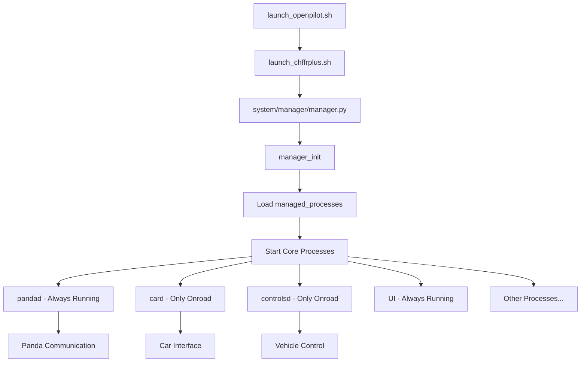
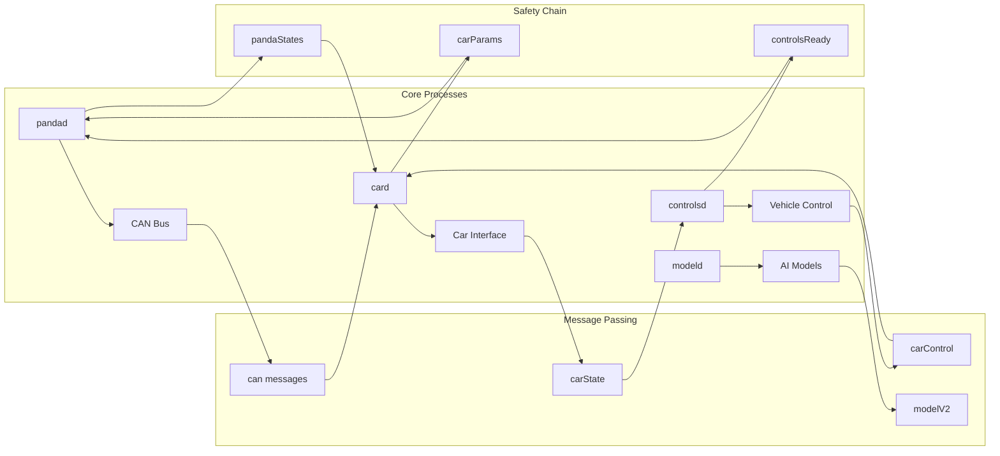
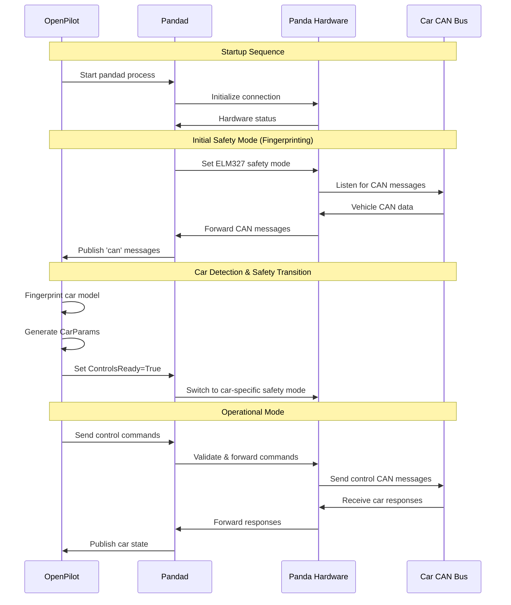
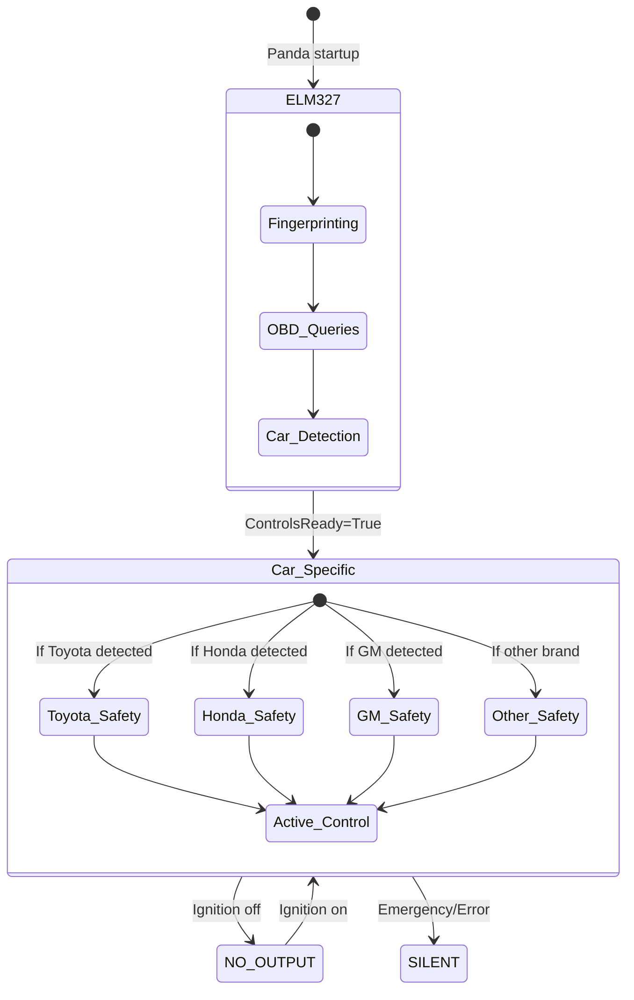
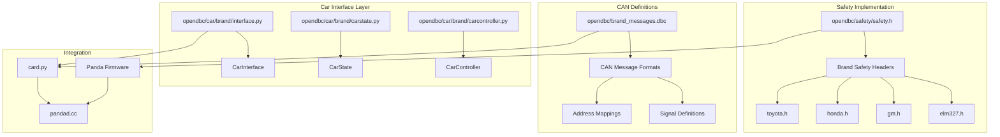
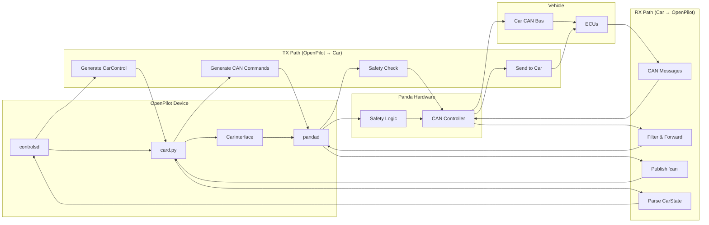

# OpenPilot Architecture Diagrams & Explanations

## Overview
This document explains how openpilot works from a process and safety perspective, focusing on the startup sequence, process dependencies, Panda communication, and safety model transitions.

## 1. Main Process Startup Flow

**Key Points:**
- `manager.py` is the main orchestrator that starts/stops all processes
- Processes are defined in `process_config.py` with conditions (always_run, only_onroad, etc.)
- `pandad` runs continuously to maintain Panda communication
- `card` and `controlsd` only run when the vehicle is onroad

## 2. Process Dependencies & Communication

**Process Roles:**
- **pandad**: Manages Panda hardware, CAN communication, safety modes
- **card**: Car interface, reads CAN messages, publishes car state
- **controlsd**: Main control logic, sends steering/acceleration commands
- **modeld**: AI model inference for path planning and object detection

## 3. Panda Communication & Safety Model Flow

## 4. Safety Model Transition Details

**Safety Mode Purposes:**
- **ELM327**: Diagnostic mode for initial car fingerprinting
- **Car-Specific**: Brand-specific safety logic (Toyota, Honda, etc.)
- **NO_OUTPUT**: Safe mode when car is off or openpilot disabled
- **SILENT**: Emergency fallback mode

## 5. File Relationships & Code Structure

**File Relationships:**
- **.h files**: C safety logic running on Panda hardware
- **.py files**: Python car interfaces running on openpilot device
- **.dbc files**: CAN message format definitions
- **Panda**: Hardware that enforces safety and bridges CAN buses

## 6. Bidirectional Communication Flow

## 7. Key Concepts Explained

### Why ELM327 First?
- **ELM327** is a diagnostic protocol that allows reading car data without sending control commands
- Used during startup to safely fingerprint the car model
- Once car is identified, switches to car-specific safety mode

### Safety Model Hierarchy
1. **Hardware Safety (Panda)**: C code, cannot be bypassed, runs on separate microcontroller
2. **Software Safety (OpenPilot)**: Python code, additional checks and logic
3. **Car Safety (Vehicle)**: Built-in vehicle safety systems

### Process Communication
- Uses **cereal** messaging system (similar to ROS)
- Processes publish/subscribe to named topics
- Examples: 'can', 'carState', 'carControl', 'pandaStates'

### Car Porting Components
When adding a new car, you need:
1. **Safety header (.h)**: Hardware safety logic for Panda
2. **DBC file**: CAN message definitions
3. **Python interface**: CarInterface, CarState, CarController
4. **Fingerprinting**: Logic to detect the specific car model

This architecture ensures safety through multiple layers while maintaining flexibility for different vehicle types.
