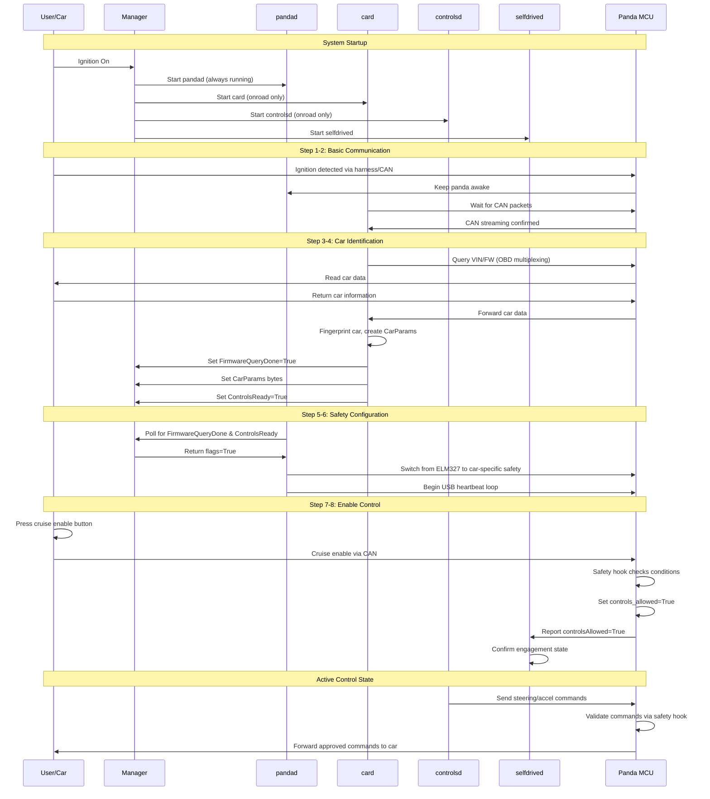
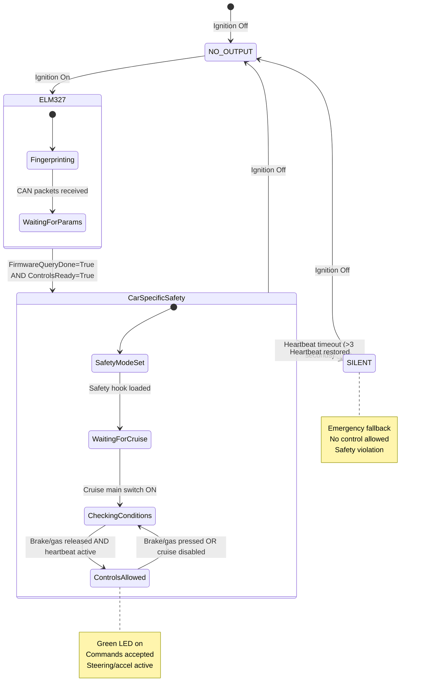
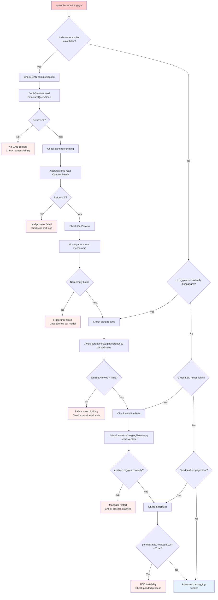

# Getting to `controls_allowed = True`

This guide explains how openpilot transitions from power-on to an active control state, and gives a troubleshooting checklist for users whose car will not engage. References point to the upstream openpilot tree in `../openpilot`.

## 1. Processes That Must Be Healthy

openpilot’s `manager` launches the daemons that ultimately enable control. Startup order and onroad gating live in `openpilot/system/manager/process_config.py:64`. For engagement you need:

- `pandad`: always running; bridges to the panda MCU, streams CAN, pushes heartbeats (`openpilot/selfdrive/pandad/pandad.cc:418`).
- `card`: starts onroad; fingerprints the car and publishes `CarParams` (`openpilot/selfdrive/car/card.py:85`).
- `controlsd`: runs the control stack once `card` reports ready.
- `selfdrived`: state machine that tracks events/alerts and mirrors panda status (`openpilot/selfdrive/selfdrived/selfdrived.py:401`).

If any of these crash or fail health checks, openpilot never reaches an enabled state.

## 2. Engagement Timeline

A successful bring-up passes the following checkpoints:

### Detailed Steps:

1. **Ignition detected**: `pandad` sees ignition through the harness or CAN and keeps the panda awake (`openpilot/selfdrive/pandad/pandad.cc:200`).
2. **CAN streaming**: `card` blocks until a CAN packet arrives, ensuring wiring is correct (`openpilot/selfdrive/car/card.py:85`).
3. **Fingerprint + firmware query**: `card` queries VIN/FW (OBD multiplexing), matches interfaces, and emits `CarParams` (`openpilot/selfdrive/car/card.py:93`).
4. **Params latched**: once initialized, `card` sets Params keys:
   - `FirmwareQueryDone = True`
   - `CarParams` bytes
   - `ControlsReady = True` (`openpilot/selfdrive/car/card.py:236`)
5. **Safety reconfiguration**: `pandad` polls Params, waits for the two flags above, then swaps pandas from `ELM327` to the car-specific safety model (`openpilot/selfdrive/panda_safety.cc:5`).
6. **Heartbeat loop**: `pandad` begins sending USB heartbeats with `selfdriveState.enabled` so panda firmware knows whether openpilot is engaged (`openpilot/selfdrive/pandad/pandad.cc:325`).
7. **Safety hook allows control**: brand-specific logic in `opendbc_repo/opendbc/safety/modes/*` sets the global `controls_allowed` flag when cruise-enable and pedal conditions match (`opendbc_repo/opendbc/safety/safety.h:45`).
8. **Selfdrived confirmation**: if openpilot thinks it is enabled but any panda reports `controlsAllowed = False`, selfdrived forces a disengagement (`openpilot/selfdrive/selfdrived/selfdrived.py:441`).

Only after all eight steps succeed should you see "openpilot engaged" in the UI and the car respond to steering/longitudinal commands.

## 3. What Drives `controls_allowed`

### Safety Enforcement Details:

The panda MCU enforces safety through multiple layers:

- The firmware copies the safety hook's global `controls_allowed` into panda state, lights the green LED, and times out if heartbeats stop (`panda/board/main.c:162`).
- If the heartbeat mismatches the engaged state, panda clears `controls_allowed` after ~3 samples and falls back to `SILENT` if heartbeats disappear for multiple seconds (`panda/board/main.c:189`).
- When ignition drops, `pandad` commands every panda back to `NO_OUTPUT` (`openpilot/selfdrive/pandad/pandad.cc:474`).

### Brand-Specific Preconditions:

Because the safety hooks differ by brand, common preconditions include:

- **Cruise main switch on**: Some cars require the user to press the set/resume button to engage.
- **Brake and gas pedals released**: Active pedal input blocks engagement.
- **Longitudinal control**: For car ports that reuse stock longitudinal control, openpilot may only be "alerting" without enabling torque.

## 4. Quick Debug Checklist (Noob Friendly)

### Command Reference:

Run these checks in a comma shell (from `../openpilot`):

- `./tools/params read FirmwareQueryDone` → should print `1` soon after ignition.
- `./tools/params read ControlsReady` → flips to `1` once `card` initializes.
- `./tools/params read CarParams` → non-empty blob confirms fingerprint success.
- `./tools/cereal/messaging/listener.py pandaStates` → watch `controlsAllowed`, `ignitionLine`, `faultStatus`.
- `./tools/cereal/messaging/listener.py selfdriveState` → ensure `enabled` mirrors your steering-wheel button presses.

### Interpretation Tips:

- `FirmwareQueryDone = 0`: panda stayed in ELM327, likely no CAN seen or OBD multiplexing blocked.
- `ControlsReady = 0`: `card` never finished `CarInterface.init()` – inspect car port logs.
- `pandaStates.controlsAllowed = False` while cruise is on: safety hook still gated; check brand-specific requirements.
- `pandaStates.heartbeatLost = True`: heartbeat timeout; confirm `pandad` process is running and selfdriveState toggles enabled.

## 5. Typical Failure Modes

| Symptom | Likely Cause | Suggested Action |
| --- | --- | --- |
| UI shows "openpilot unavailable" | `card` not publishing `CarState` (no CAN) | Verify harness orientation; check `card` stdout (`tmux attach -t card`). |
| UI toggles enabled, instantly disengages | Panda reports `controlsAllowed = False` | Inspect `pandaStates`; confirm cruise/pedal state matches safety expectations. |
| Green panda LED never lights | Heartbeat never marks engaged | Confirm `selfdriveState.enabled` flips; watch for manager restarts due to crashes. |
| Sudden disengage after several seconds | Heartbeat timeout path triggered | Check for USB instability; look for `heartbeats lost` warnings in `pandad`. |
| ControlsReady keeps clearing | Manager restart or `carParams` wiped on transition | Ensure device stays onroad; review `Params` clear semantics (`common/params_keys.h:28`). |

## 6. For Documentation Roadmap

- Expand the safety section with summaries of common brand-specific gating logic (e.g., Honda cruise enable, Toyota torque limits).
- Add diagrams that link the Params keys above with the process timeline for training new installers.
- Cross-link this page from the existing architecture overview (`knowledge/openpilot/architecture.md`) and from any end-user troubleshooting index.

Keeping these references handy lets a new driver reason about why "control allowed" never flips and points them to the exact code paths responsible.
